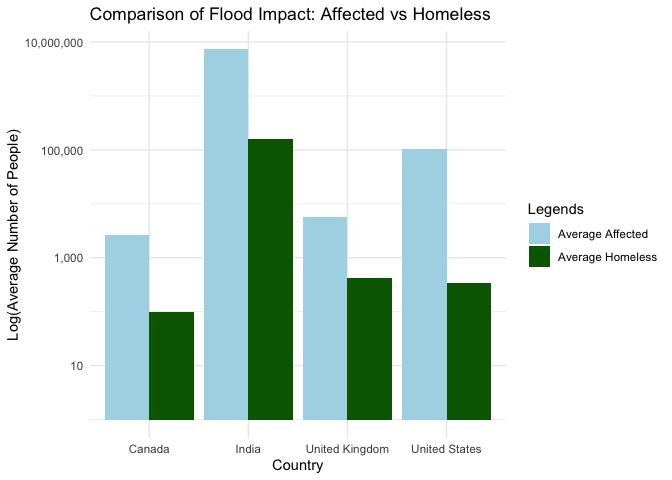

<style>
  title{
    font-size: 3em;
  }
  toc {
  color: darkgreen;
  font-size: 10px;
}
  body {
    font-size: 16px;
  }
  h1 {
    font-size: 2.5em;
  }
  h2 {
    font-size: 1.5em;
  }
  h3{
    font-size: 1.2em;
}
</style>

<br>

# Client Bio & Recommendation

## Client Information

The client for this report is AllState Insurance company’s Senior Product Manager, Mr. Kunal Gupta 

[Mr. Kunal Gupta on LinkedIN](https://www.linkedin.com/in/kunalgupta028/?originalSubdomain=in).

## Company Information

Allstate Corporation is an insurance company that owns and operates over 19 companies around the United States, United Kingdom, Canada, and India. Based in San Francisco, California: Esurance, Inc. In this report, recommendations regarding the interests of AllState’s expansion in the Indian Insurance market have been made.

## Recommendations

Upon examination of evidences collected, addressing an increasing demand in flood insurance has been pointed out as a strong means of standing out in the Indian Market. The recommended amendments to the policies regarding floods are:

1. <span style="color: rgb(201, 79, 2); font-size: 17px">**Introduction of temporary housing cost coverage for people facing homelessness due to flood.** </span> A pilot program of up to $20,000 for temporary accommodation and related expenses is suggested.

2. <span style="color: rgb(201, 79, 2); font-size: 17px">**Expand personal property coverage to include up to $50,000 for flood-damaged contents,**</span>  covering items like furniture, electronics, and personal belongings without depreciation.


<br>


# Evidence


## Initial Data Analysis (IDA)

### Source and Validity

The dataset for this report has been taken from [Our World in Data](https://ourworldindata.org/natural-disasters) Natural Disasters Dataset. This data is valid for this report as it covers various disaster types and their impacts, allowing comparisons across countries and evaluation of economic and devastation effects.

### Assumptions

- The dataset accurately represents actual conditions in the regions and periods covered.

- Data from different countries and years are comparable, using similar definitions and measurement standards across observations.


### Rows and Columns

The dataset contained 171 variables. We evaluated `Year,` `Number of people affected by floods,` `Number of people left homeless from floods,` `Insured damages against drought,` `Insured damages against floods,` and `Insured damages against earthquakes` for four countries. Columns were the variables; each row represented data for a country.

### Data Cleaning

In the Flood Impact section, data is filtered for specific countries and relevant columns, then averaged for flood impact variables. In the Trends in Insured Damages section, India's insured damages for various disasters are filtered from 1980 onwards, excluding NA values. Data is reshaped and cleaned for plotting trends over time.


```r
library(tidyverse)

data <- read_csv("natural-disasters.csv")
```

## Flood Impact

<span style="font-size:24px; background-color: lightgreen;">How do flood impacts differ in terms of affected and homeless populations among AllState's operating countries: USA, UK, India, and Canada?</span>


```r
filterData <- data %>%
  filter(Entity %in% c("India", "United Kingdom", "United States", "Canada")) %>%
  select(Entity, Year, `Number of people affected by floods`, `Number of people left homeless from floods`)

avgData <- filterData %>%
  group_by(Entity) %>%
  summarize(
    avgAffected = mean(`Number of people affected by floods`, na.rm = TRUE),
    avgHomeless = mean(`Number of people left homeless from floods`, na.rm = TRUE)
  ) %>%
  pivot_longer(cols = c(avgAffected, avgHomeless), names_to = "Legends", values_to = "Value")

ggplot(avgData, aes(x = Entity, y = Value, fill = Legends)) +
  geom_bar(stat = "identity", position = position_dodge()) +
  scale_y_log10(labels = scales::comma_format()) +
  labs(x = "Country", 
       y = "Log(Average Number of People)", 
       title = "Comparison of Flood Impact: Affected vs Homeless"
       ) +
  
  scale_fill_manual(
    values = c("avgAffected" = "lightblue", "avgHomeless" = "darkgreen"),
    labels = c("avgAffected" = "Average Affected", "avgHomeless" = "Average Homeless")
  ) +
  theme_minimal()
```

<!-- -->

From the graph, it's clear that <span style="background-color: lightgreen; font-size: 17px;">India suffers the most from floods and homelessness</span>. India averages over 6 million people affected by floods and over 200,000 made homeless, significantly higher than Canada, the UK, and the USA, each with figures under 10,000.

## Hypothesis Test

Now we verify our finding by conducting a Welch Test on the following Hypothesis:

- <span style="color: rgb(201, 79, 2)">**Null Hypothesis:**</span> There is no difference in Number of People Affected in India compared to the mean of US, UK and Canada.

- <span style="color: rgb(201, 79, 2)">**Alternative Hypothesis:**</span> There is significant difference in Number of People Affected in India compared to the mean of US, UK and Canada.


```r
filtered_data <- filterData %>% filter(Year > 1979) #filter to data greater than 1980 
india_data <- filtered_data %>% filter(Entity == "India") %>% select(`Number of people affected by floods`)
other_data <- filtered_data %>% filter(Entity != "India") %>% select(`Number of people affected by floods`)
result <- t.test(india_data, other_data)
result
```

```
## 
## 	Welch Two Sample t-test
## 
## data:  india_data and other_data
## t = 4.5501, df = 3.003, p-value = 0.01985
## alternative hypothesis: true difference in means is not equal to 0
## 95 percent confidence interval:
##   5729998 32347225
## sample estimates:
##  mean of x  mean of y 
## 19146882.8   108271.1
```

```r
print(paste("P-value:", result$p.value))
```

```
## [1] "P-value: 0.0198465172816344"
```

The p-value (< 0.05) indicates a statistically significant difference, leading us to reject the null hypothesis and conclude that the number of people affected by floods in India is significantly higher than in other countries.

## Trends in Insured Damages

<span style="font-size:24px;background-color: lightgreen;">How do insured damages from different disaster types in India compare over time?</span>


```r
# Filter data for India
indiaData <- data %>% filter(Entity == "India")

indiaLong <- indiaData %>%
  select(Year, `Insured damages against drought`, `Insured damages against floods`,
         `Insured damages against earthquakes`) %>%
  pivot_longer(cols = starts_with("Insured damages"),
               names_to = "DisasterType",
               values_to = "InsuredDamages") %>%
  mutate(DisasterType = str_to_title(str_replace(DisasterType, "Insured damages against ", "")))


# Filter data for India starting from the year 1980 and remove NA values
india_long_filtered <- indiaLong %>%
  filter(Year >= 1980 & !is.na(InsuredDamages))

# Line plot to show trends over time
ggplot(india_long_filtered, aes(x = Year, y = InsuredDamages, color = DisasterType, group = DisasterType)) +
  geom_line() +
  geom_point(size = 1.5) +
  labs(title = "Trends in Insured Damages in India for Various Disasters",
       x = "Year",
       y = "Insured Damages (in monetary units)",
       color = "Disaster Type") +
  theme_minimal() +
  scale_y_continuous(labels = scales::comma)
```

<!-- -->

In India, insured damages from floods have significantly surpassed those from droughts and earthquakes, with flood damages exceeding 150,000 monetary units, while drought and earthquake damages remain below 50,000 monetary units.<span style="background-color: lightgreen; font-size: 17px;"> This rising trend in flood insurances indicates a growing market demand.</span>

## Further Evidence

We exhibit further validation for the recommendations in the following media articles:

- [Banking Frontiers Article on Flood Insurance in India](https://bankingfrontiers.com/flood-insurance-yet-to-gain-popularity-in-india/)

- [LinkedIn Pulse Article on Flood Insurance Market](https://www.linkedin.com/pulse/latest-size-flood-insurance-market-dajlf/)

These analyses underscore a lack of dedicated flood-damage policies in India. Aligning with global practices like Germany's comprehensive coverage and addressing the limitations seen in the U.S., adding temporary housing costs and expedited claims processing to AllState's policies will address uninsured risks and offer crucial support during flood crises.

<br>

# Acknowledgments

## References

R Documentation and manuals. (2019). R Documentation. Retrieved from [https://www.rdocumentation.org/](https://www.rdocumentation.org/)

Spanton, R. (2020, August 13). An Introduction to the Pipe in R. Medium. Retrieved from [https://towardsdatascience.com/an-introduction-to-the-pipe-in-r-823090760d64](https://towardsdatascience.com/an-introduction-to-the-pipe-in-r-823090760d64)

Zach. (2022, March 23). How to Use pivot_longer() in R. Statology. Retrieved from [https://www.statology.org/pivot_longer-in-r/](https://www.statology.org/pivot_longer-in-r/)

Replace matches with new text — str_replace. (n.d.). Stringr.tidyverse.org. Retrieved from [https://stringr.tidyverse.org/reference/str_replace.html](https://stringr.tidyverse.org/reference/str_replace.html)

geom_line. (n.d.). Plotly.com. Retrieved from [https://plotly.com/ggplot2/geom_line/](https://plotly.com/ggplot2/geom_line/)

[Latest Size] Flood Insurance Market to See Huge Growth [with CAGR of %] by 2032. (n.d.). LinkedIn. Retrieved May 17, 2024, from [https://www.linkedin.com/pulse/latest-size-flood-insurance-market-dajlf/](https://www.linkedin.com/pulse/latest-size-flood-insurance-market-dajlf/)

Mohan, Banking Frontiers. (2024, February 27). Flood Insurance Yet to Gain Popularity in India. Banking Frontiers. Retrieved from [https://bankingfrontiers.com/flood-insurance-yet-to-gain-popularity-in-india/](https://bankingfrontiers.com/flood-insurance-yet-to-gain-popularity-in-india/)

Statistics Solutions. (2024, April 11). How to use the Wilcoxon Sign Test for paired samples. [https://www.statisticssolutions.com/free-resources/directory-of-statistical-analyses/assumptions-of-the-wilcox-sign-test/](https://www.statisticssolutions.com/free-resources/directory-of-statistical-analyses/assumptions-of-the-wilcox-sign-test/)

<br>


# Appendix

## Client Choice
Brainstorming potential clients for a disaster analysis report led me to consider an insurance company. This focus prompted me to emphasize monetary variables related to insurance coverages and claims, aligning with the financial interests of such a client.

## Statisitcal Analyses

### Hypothesis Test Validation

We used hypothesis testing to determine if there was a significant difference in the average number of people affected by floods in India compared to the average number in the US, UK, and Canada. First, we conducted an F test to check if the variances of the two populations were equal.


```r
variance_india <- var(india_data$`Number of people affected by floods`, na.rm = TRUE)
variance_others <- var(other_data$`Number of people affected by floods`, na.rm = TRUE)
print(paste("Variance for India: ", variance_india))
```

```
## [1] "Variance for India:  69996343455728.5"
```

```r
print(paste("Variance for other countries: ", variance_others))
```

```
## [1] "Variance for other countries:  104264864256.08"
```

```r
print(paste("Ratio of Variances: ", variance_india/variance_others))
```

```
## [1] "Ratio of Variances:  671.33203457508"
```

Since the variances are unequal, we verify normality using a QQ plot and then perform the Welch Test for robust mean comparison.


```r
combined_data <- bind_rows(
  india_data %>% mutate(Entity = "India"),
  other_data %>% mutate(Entity = "Other Countries")
)

ggplot(combined_data, aes(sample = `Number of people affected by floods`, color = Entity, shape = Entity)) +
  geom_qq() +
  geom_qq_line() +
  labs(title = "QQ Plot for Number of People Affected by Floods",
       x = "Theoretical Quantiles",
       y = "Sample Quantiles",
       color = "Country",
       shape = "Country") +
  theme_minimal()
```

<!-- -->

<br> 

### HATPC Approach

<span style="color: rgb(201, 79, 2); font-size: 20px;">H:</span> **Hypothesis \( H_0 \) vs \( H_1 \)**

- **Null Hypothesis (\( H_0 \))**: There is no difference in the number of people affected by floods in India compared to the mean of the US, UK, and Canada.

- **Alternative Hypothesis (\( H_1 \))**: There is a significant difference in the number of people affected by floods in India compared to the mean of the US, UK, and Canada.

<span style="color: rgb(201, 79, 2); font-size: 20px;">A:</span> **Assumptions**

- **The 2 samples are independent:** The two samples (India and other countries) contain different data points.

- **The 2 populations are not equally spread (SD/variance):** We do not assume that the 2 populations to have the same variation in the number of people affected by floods.

- **The 2 populations are normal:** We assume that the 2 populations have normally distributed values for the number of people affected by floods.

<span style="color: rgb(201, 79, 2); font-size: 20px;">T:</span> **Test Statistic**


```r
print(paste("t-value:", result$statistic))
```

```
## [1] "t-value: 4.55008807548006"
```

<span style="color: rgb(201, 79, 2); font-size: 20px;">P:</span> **P-Value**


```r
print(paste("P-value:", result$p.value))
```

```
## [1] "P-value: 0.0198465172816344"
```

<span style="color: rgb(201, 79, 2); font-size: 20px;">C:</span> **Conclusion**

The p-value being < 0.05, <span style="background-color: lightgreen; font-size: 17px;"> we reject the null hypothesis.</span>

## Possible Limitations

- Some countries lack the infrastructure to record certain data values accurately.

- Data accuracy in disaster-stricken areas may be compromised due to chaotic conditions or poor reporting mechanisms.

- The dataset may omit key variables affecting homelessness and insurance claims, such as government aid and local infrastructure.

- Reporting delays can impact the accuracy of time-sensitive flood data.
